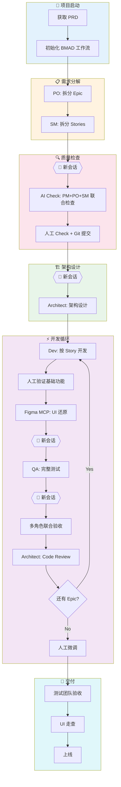
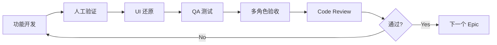
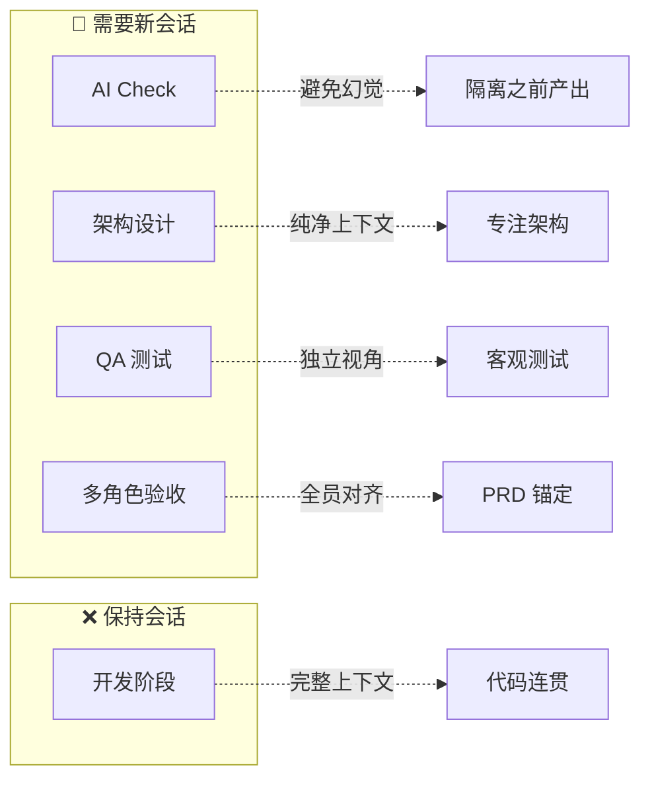

---
group:
  title: AI 打铁铺
tags:
  - AI
  - BMAD
  - AI Coding
  - 工作流
sidebar: false
sticky: 1
date: 2025-10-31 00:00:00
recommend: 1
title: 前端 AI-Coding 工程化 | 基于 BMAD 的开发工作流设计
description: 以 BMAD 4.4 方法为核心，结合企业内部已有的产品研发体系，实现从 PRD 到开发交付的完整闭环。采用"多角色 + 多会话 + 人工复核 + 上下文交接包"机制，减少 AI 幻觉、提升交付质量。
cover: ""
---

# 前端 AI-Coding 工程化 | 基于 BMAD 的开发工作流设计

> **BMAD 4.4 Hybrid Workflow — 人机协作多会话模式**
>
> 一套经过实战验证的 AI 辅助开发工作流，解决 Vibe Coding 场景下的质量与效率平衡问题。

## TL;DR

这套工作流的核心设计理念可以用一句话概括：

**「多角色分工 + 多会话隔离 + 人工卡点复核 + 上下文精准控制」**

它解决了三个关键问题：

| 问题 | 解法 |
| :--- | :--- |
| AI 幻觉导致需求偏移 | 多角色交叉检查 + PRD 原文锚定 |
| 上下文污染导致输出质量下降 | 关键节点开新会话，隔离上下文 |
| 人工复核心智负担过大 | 分层检查策略，只看该看的 |

---

## 一、工作流全景图



---

## 二、核心名词速查

| 缩写 | 全称 | 职责 |
| :--- | :--- | :--- |
| PM | Product Manager | 产品经理，需求来源 |
| PO | Product Owner | 产品负责人，Epic 拆分 |
| SM | Scrum Master | 敏捷教练，Stories 细化 |
| QA | Quality Assurance | 测试工程师，质量保障 |
| Dev | Developer | 开发工程师，代码实现 |
| Architect | Architect | 架构师，架构设计与 Review |

| 缩写 | 全称 | 说明 |
| :--- | :--- | :--- |
| PRD | Product Requirement Doc | 产品需求文档 |
| Epic | Epic | 用户故事合集（史诗） |
| Stories | User Stories | 用户故事，开发最小单元 |

---

## 三、工作流详解

### Phase 1: 项目启动

#### Step 1 - 获取 PRD

从 PM 处获取完整的产品需求文档，这是整个流程的**唯一真相来源**。

#### Step 2 - 初始化工作流

在 IDE 中启动 BMAD 工作流，向元角色 Master 说明开发目标：

```
@bmad-master.md 我准备开发一个查单词的功能，集成到学生端项目中，
目前 PRD 已经完成，[prd文件目录]
```

---

### Phase 2: 需求分解

#### Step 3 - 拆分 Epic

**执行者：** PO（Product Owner）

根据 PRD 中的功能模块划分，将需求拆解为多个 Epic：

```
@PO 查看 PRD 并根据功能模块划分拆分为多个 Epic
```

#### Step 4 - 拆分 Stories

**执行者：** SM（Scrum Master）

基于 PRD 和已拆分的 Epic，继续细化为粒度更小的用户故事：

```
@SM 根据 PRD 内容和已经拆分的 Epic，细化整理完整的用户故事
```

---

### Phase 3: AI 辅助质检

#### Step 5 - Epic & Stories AI 检查

> ⚠️ **关键操作：打开新会话**
>
> 不要让模型在同一会话中读到之前产生的 Epic 和 Stories，会产生幻觉。直接新开会话，给上一步产出的文档，这是有本质区别的。

**操作步骤：**

1. 将每个 Epic 对应的 **PRD 原文**直接复制粘贴进来
2. 召集 PM、PO、SM 三个角色同时检查
3. AI 会按严重等级排序列出问题（大概率会有细节问题）
4. 人工决策并给出修订意见：
   - 常规操作：让 AI 参考 PRD 原文修改
   - 特殊情况：信息缺失时，找 PM 核对确认
5. AI 根据人工意见修订 Epic 和 Stories

**为什么需要这一步？**

- AI 存在幻觉问题，前面步骤的产出不一定完全准确
- 大部分人没有足够耐心完整阅读所有 Epic 和 Stories

---

### Phase 4: 人工质量把关

#### Step 6 - 人工检查 + 版本锁定

**检查策略（省力版）：**

| 检查对象 | 检查方式 | 原因 |
| :--- | :--- | :--- |
| Epic | 通读全文 | 内容不长，主要是概括性内容 |
| Stories | 只看文件名 | 通过文件名判断覆盖范围是否完整 |

**版本保护：**

检查修订完成后，**立即提交到 Git**，防止后续 AI 在不知情的情况下篡改内容。

---

### Phase 5: 架构设计

#### Step 7 - 系统架构设计

> ⚠️ **关键操作：打开新会话**

**准备工作：**

- 导出 API 文档并放入项目的 `docs` 目录
- 收集完整材料：PRD + Epic + Stories + API 文档

**执行流程：**

将所有材料提供给架构师角色，输出架构文档。

**人工审核重点：**

- ✅ 目录结构是否合理
- ✅ 架构模式是否适配
- ✅ 技术栈选型是否恰当

> 💡 **省力建议**
>
> 不必全篇通读架构文档，心智负担太大。即使我们通读全篇并修改得非常准确，在实际实现过程中 AI 也不一定完全遵循——这跟人工开发是一样的道理。

---

### Phase 6: 开发循环

这是整个工作流的核心循环，按 Epic 粒度迭代：



#### Step 8.1 - 功能开发与基础验证

> ⚠️ **关键操作：不开新会话**，Dev 需要完整上下文

架构文档完成后，交给 Dev 按用户故事顺序依次开发。

**开发节奏：**

- 通常开发完一整个 Epic 后再进行人工检查
- 检查功能完整性和明显 Bug
- 发现问题 → Vibe Coding → Dev 修复

#### Step 8.2 - UI 还原

**操作方式：**

利用 Figma MCP 进行 UI 调整。

> ⚠️ **重要建议**
>
> 不管 UI 还原效果如何，**只做 1-2 轮 AI 交互**，不要在这里浪费时间。AI 做不到 100% 还原设计稿，这是当前技术边界。

#### Step 8.3 - 问题修复

UI 调整过程中可能引入新问题，继续 Vibe Coding 让 Dev 解决。

#### Step 8.4 - QA 完整测试

> ⚠️ **关键操作：打开新会话**

人工粗略测试找不出更多问题后，交给 QA 执行完整测试流程：

```
遇到问题 → Dev 修改 → QA 测试 → 循环直到通过
```

#### Step 8.5 - 多角色联合验收

> ⚠️ **关键操作：打开新会话**

**准备工作：**

- 引用所有关键角色：PM、Architect、Dev、QA、PO
- **再次复制 PRD 中对应功能模块的原始内容**（非常重要）

**执行方式：**

召开多角色会议（使用 `*party-mode` 命令或直接说"开会"），共同验收整个 Epic 功能。

#### Step 8.6 - Code Review

交给架构师进行代码提交前的最终 Review：

```
发现问题 → Dev 修改 → QA 验收 → 循环直到通过
```

---

### Phase 7: 精细化调优

#### Step 9 - 人工微调

所有 Epic 开发完成后，切换回 Augment 模式，结合手动调整进行微调：

- 小 Bug 修复
- 交互优化
- 样式调整
- 其他细节问题

---

### Phase 8: 交付验收

#### Step 10 - 最终交付

- 交付给测试团队进行完整测试
- 进行 UI 走查
- 最终交付上线

---

## 四、关键流程速查表

| 步骤 | 阶段 | 会话策略 | 主要角色 | 核心产出 | 人工检查重点 |
| :--- | :--- | :---: | :--- | :--- | :--- |
| 3 | Epic 拆分 | 保持 | PO | Epic 列表 | - |
| 4 | Stories 拆分 | 保持 | SM | User Stories | - |
| 5 | AI Check | 🔄 新会话 | PM+PO+SM | 修订后的文档 | 决策修订意见 |
| 6 | 人工 Check | 保持 | 人工 | 确认版本 | Epic 通读，Stories 看文件名 |
| 7 | 架构设计 | 🔄 新会话 | Architect | 架构文档 | 目录、模式、技术栈 |
| 8.1 | 功能开发 | ❌ 保持 | Dev | 功能实现 | 完整性、明显 Bug |
| 8.2 | UI 调整 | 保持 | Dev | UI 实现 | 1-2 轮即可 |
| 8.4 | QA 测试 | 🔄 新会话 | QA | 测试报告 | - |
| 8.5 | 多角色验收 | 🔄 新会话 | 全员 | 验收通过 | 对照 PRD 原文 |
| 8.6 | Code Review | 保持 | Architect | Review 通过 | - |
| 9 | 人工微调 | - | 人工 | 最终版本 | 细节完善 |
| 10 | 交付 | - | 测试+UI | 上线 | - |

---

## 五、核心设计原则

### 上下文控制策略



**核心逻辑：**

- **新会话**：需要独立判断、避免被之前产出污染的场景
- **保持会话**：需要完整上下文、代码连贯性的场景

### 人工检查策略

| 检查对象 | 深度 | 原因 |
| :--- | :--- | :--- |
| Epic | 通读 | 概括性内容，篇幅不长 |
| Stories | 仅文件名 | 降低心智负担，覆盖范围判断 |
| 架构文档 | 重点抽查 | 实现时也不会完全遵循 |

**总原则：** 不必全篇通读，避免心智负担过大

### AI 能力边界认知

| 场景 | 建议 | 原因 |
| :--- | :--- | :--- |
| Figma UI 还原 | 1-2 轮交互 | AI 做不到 100% 还原 |
| 架构设计 | 不追求完美 | 实现时也不会完全遵循 |
| Epic/Stories 拆分 | 必须 AI Check | 存在幻觉问题 |

### PRD 原文的锚定作用

**需要引用 PRD 原文的场景：**

- Step 5 AI Check：让 AI 参考原文修改
- Step 8.5 多角色验收：作为验收的权威参考

**作用：** 确保所有环节都以 PRD 为准，避免需求偏移

---

## 六、核心理念

> 理解 AI 的能力边界，合理分配人工和 AI 的工作，通过流程设计和多轮验证确保功能完整性和最终质量。

这套工作流解决的核心问题：

1. **如何系统设计人机交互工作流** — 多角色分工 + 会话隔离
2. **如何找到人机交互的平衡点** — 分层检查策略，只看该看的
3. **如何做好上下文管理** — 关键节点新开会话，精准控制

这几个问题看起来简单，实则一点都不简单。需要通过长期的 AI 实践经验，在实践中融会贯通并内化为直觉。

**AI 时代最重要的能力之一：找到边界，扩展边界。**

模型能力在变、模型应用方式在变（Agent、工作流等），对于个人来说，能不能找到模型的能力边界、能不能找到自己使用模型的能力边界，是把 AI 用好最重要的能力之一。

---

## 七、优缺点分析

| 维度 | 优点 | 缺点 |
| :--- | :--- | :--- |
| **个人** | 稳定、结果一致 | 繁琐、牺牲灵活与效率 |
| **团队** | 标准化、可复制、提升交付质量 | 培训成本、执行复杂度 |

**适用场景：**

- 企业级项目，需要稳定交付质量
- 团队协作，需要标准化流程
- Vibe Coding 场景，需要控制 AI 幻觉

**不适用场景：**

- 快速原型验证
- 个人小项目
- 对流程灵活性要求高的场景

---