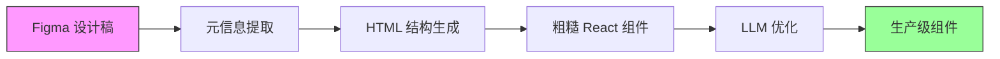
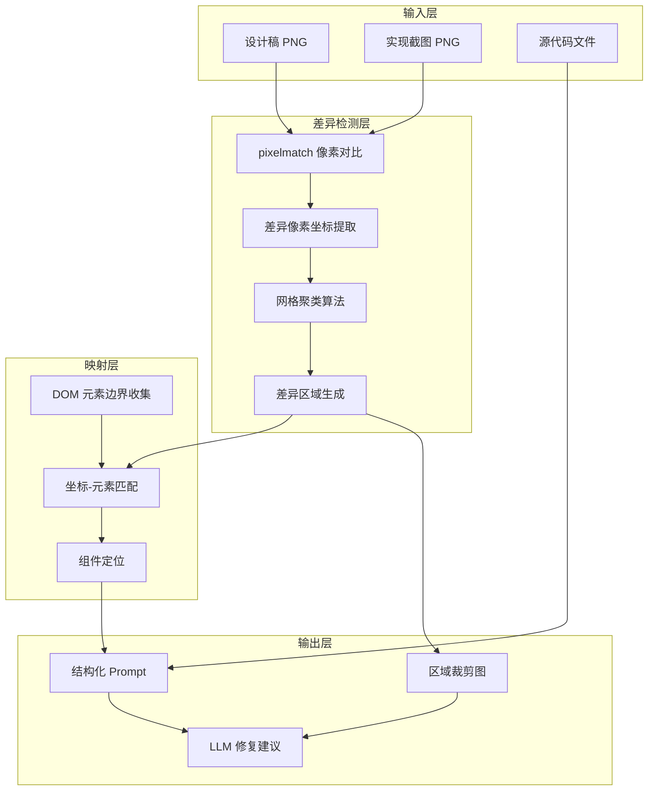
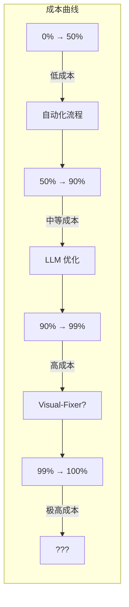
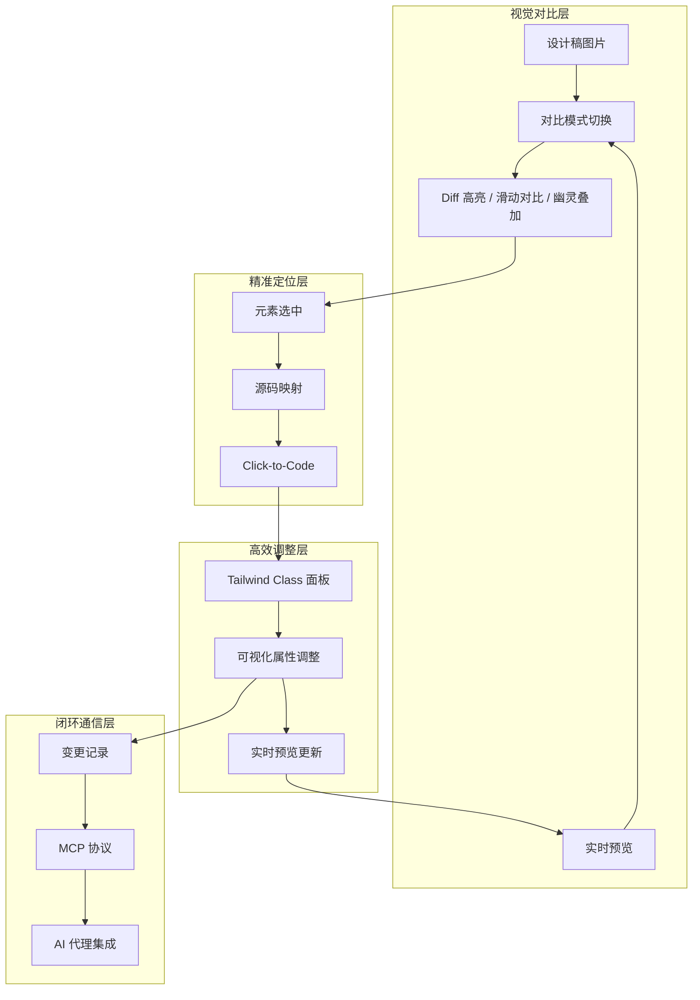
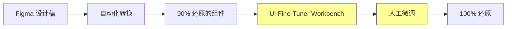

---
group:
  title: AI 打铁铺
tags:
  - AI
  - Figma-to-Code
  - UI 还原
  - 人机协同
  - LLM
sidebar: false
sticky: 2
date: 2024-12-17 00:00:00
recommend: 2
title: UI 还原最后一公里：从自动化幻觉到人机协同微调
description: 一份关于 Figma-to-Code 工程实践的技术白皮书。记录了从全自动化方案的期待，到 Visual-Fixer 的设计与实现，再到通过实证数据认清其局限性，最终转向人机协同微调新范式的完整技术探索。
cover: ""
---

# UI 还原最后一公里：从自动化幻觉到人机协同微调

> 一份关于 Figma-to-Code 工程实践的技术白皮书

---

## 摘要

在 Figma-to-Code 的工程实践中，我们观察到一个显著的"帕累托低效"现象：**90% 的 UI 还原可以通过自动化流程稳定达成，但剩余 10% 的像素级微调却消耗了不成比例的工程资源**。

本白皮书记录了我们在解决这一问题过程中的完整技术探索：从最初对全自动化方案的期待，到 Visual-Fixer 的设计与实现，再到通过实证数据认清其局限性，最终转向人机协同微调的新范式。

我们的核心发现是：**从 90% 到 100% 的边际成本是指数级的**。与其让 LLM 在分散的像素差异中挣扎，不如将工程资源投入到优化人工微调的效率上——让人看得更清、改得更快。

---

## 1. 背景：我们面临的真实问题

### 1.1 当前技术栈与成果

我们已经建立了一套相对成熟的 Figma-to-Code 转换流程：



通过 Figma 插件提取设计元信息，经过多轮 LLM 优化，我们已经能够稳定地将设计稿转换为可用的 React 组件。**准确度已稳定达到 90% 以上**——这意味着组件的整体结构、布局逻辑、交互状态都能正确还原。

### 1.2 真正的痛点：最后 10%

然而，剩余的 10% 成为了工程效率的黑洞。这些问题通常是：

- 某个按钮的内边距差了 4px
- 某段文字的行高与设计稿不一致
- 某个卡片的圆角半径需要微调
- 某处颜色的色值存在细微偏差

这些问题的共同特点是：**单个问题很小，但数量多、分布散、定位难**。

传统的调试方式是：打开 Figma 查看设计稿参数 → 切回 IDE 找到对应代码 → 修改 → 刷新浏览器 → 切回 Figma 对比 → 发现还有偏差 → 重复以上步骤。这个循环极其消耗精力，而且效率高度依赖开发者的个人经验。

### 1.3 一个自然的想法

面对这个痛点，我们产生了一个直觉上很合理的想法：

> **能否用像素级图像对比来精确定位差异，然后让 LLM 自动修复？**

这个想法的吸引力在于：如果 LLM 能够"看到"具体哪些像素有问题，它就不需要"猜测"，而是基于客观证据进行修复。我们将这个方向命名为 **Visual-Fixer**。

---

## 2. Visual-Fixer：我们的第一次尝试

### 2.1 设计动机：用客观计算约束主观推理

Visual-Fixer 的核心假设是：**LLM 的幻觉问题源于缺乏客观约束**。

在常规的 UI 修复场景中，我们只能告诉 LLM "这个组件和设计稿有差异，请修复"。LLM 会基于它对代码的理解进行推测，但这种推测往往不准确——它可能修复了不存在的问题，或者声称已修复但实际并未解决。

我们的思路是：**用 pixelmatch 的像素级对比结果作为硬证据**，告诉 LLM 差异的精确位置和范围，从而将"主观猜测"转化为"客观定位"。

### 2.2 技术架构

我们设计了一套完整的流程：



**核心技术点：**

1. **像素坐标提取**：遍历 pixelmatch 生成的 diff buffer，非零像素即为差异点，记录其 (x, y) 坐标
2. **区域聚类**：使用网格化 + 相邻合并算法，将零散的差异像素聚合成有意义的矩形区域
3. **DOM 映射**：通过 Puppeteer 注入脚本收集所有元素的 `getBoundingClientRect()`，计算差异区域与元素边界的重叠面积
4. **Prompt 构建**：将差异区域、匹配元素、源代码组装成结构化的 LLM 输入

### 2.3 实现与测试

我们完整实现了这套方案，包括：

- `differ` 模块：pixelmatch 封装 + 区域聚类
- `mapper` 模块：DOM 元素定位 + 坐标匹配
- `fixer` 模块：Prompt 生成 + 响应解析
- `pipeline`：端到端流程编排
- CLI 工具：命令行入口

然后，我们用两张实际的设计稿和实现截图进行了测试。

### 2.4 测试结果：令人清醒的数据

```
测试图片尺寸: 1374 x 856
差异像素数量: 62,898
差异占比: 5.35%
检测到的差异区域: 1 个
区域位置: x=0, y=0
区域尺寸: 1374 x 856（整张图）
```

**结果分析：**

虽然 pixelmatch 准确地检测到了 5.35% 的像素差异（62,898 个像素），但聚类算法将这些分散的差异合并成了**一个覆盖整张图的大区域**。

这意味着我们给 LLM 的信息是："整张图都有问题"——这与不使用 Visual-Fixer 相比，**没有任何信息增益**。

生成的 Prompt 中，差异区域的描述是：

```
位置: x=0, y=0, 尺寸: 1374x856
差异像素数: 1176144
匹配到的元素: 无
```

LLM 面对这样的输入，依然只能"猜测"哪里需要修复。

---

## 3. 反思：为什么 Visual-Fixer 在实践中失效

### 3.1 差异分散的必然性

UI 微调阶段的差异本质上是**分散的**。不像功能缺失导致的大面积空白，最后 10% 的问题是：

- 这里多了 2px 间距
- 那里颜色深了一点
- 某处字体小了一号

这些差异在像素层面是零星分布的，任何聚类算法都会将它们合并成一个大区域——因为它们在空间上确实没有明确的边界。

### 3.2 噪声干扰

即使设计稿和实现在视觉上"几乎一致"，pixelmatch 仍会检测到大量差异：

- **抗锯齿差异**：字体渲染、圆角边缘
- **亚像素渲染**：不同浏览器/系统的渲染差异
- **压缩噪声**：图片导出时的压缩损失

这些"假阳性"进一步稀释了真正有意义的差异信号。

### 3.3 边际效益递减的经济学



我们不得不承认一个事实：**90% → 100% 的成本曲线是指数级的**。

Visual-Fixer 的设计假设是"更精确的输入 = 更准确的输出"，但在 UI 微调场景下，这个假设不成立。因为：

1. 差异信息本身就是分散的，无法提供精确定位
2. 即使定位准确，LLM 仍需理解设计意图才能正确修复
3. 修复后需要人工验证，这个成本不会因为自动化而消失

### 3.4 核心教训

> **LLM 不是银弹。最后一公里需要人类介入，但我们可以让这个介入过程变得极其高效。**

---

## 4. 范式转移：从全自动化到人机协同

### 4.1 重新定义问题

Visual-Fixer 失败后，我们重新审视了问题本身：

**原问题**：如何让 LLM 自动修复 UI 差异？
**新问题**：如何让人类开发者更高效地完成 UI 微调？

这个转变看似是"退步"，实际上是对工程现实的尊重。

### 4.2 人工微调的效率瓶颈在哪里？

通过分析开发者的实际工作流，我们发现效率损耗主要在三个环节：

1. **差异发现**：需要在 Figma 和浏览器之间反复切换，肉眼对比
2. **问题定位**：发现差异后，需要在代码中找到对应的元素
3. **参数调整**：需要查阅 Figma 的具体数值，再翻译成 Tailwind class 或 CSS

如果我们能在这三个环节提供强力的工具支持，即使保留人工介入，整体效率也可以大幅提升。

### 4.3 人机协同的理论基础

研究表明，在 AI 辅助任务中，**保留 10% 的人类关键决策介入，可以将系统整体准确率提升 71%**。这被称为"总督模式"（Governor Pattern）：

- **AI 负责**：繁琐的执行细节（计算差异、生成代码片段、格式化输出）
- **人类负责**：高级意图判断、审美决策、最终验收

在 UI 微调场景下，人类的不可替代性体现在：

- 判断某个 4px 的偏差是否真的需要修复
- 在多个可行方案中选择更符合设计系统的那个
- 感知整体视觉平衡，而非局部像素对齐

---

## 5. 新方案：UI Fine-Tuner Workbench

基于以上反思，我们设计了一套新的解决方案：**UI Fine-Tuner Workbench**。

### 5.1 核心理念

> **让人看得更清、改得更快、闭环更短。**

不再追求全自动修复，而是打造一个高效的人机协作环境。

### 5.2 系统架构



### 5.3 核心功能模块

#### 5.3.1 视觉对比层：让差异无处遁形

- **滑动对比**：设计稿和实现的分屏滑动对比，直观展示差异
- **Diff 高亮**：基于 pixelmatch 的差异高亮，快速定位问题区域
- **幽灵叠加**：将设计稿以半透明形式叠加在实现上，使用 `pointer-events: none` 实现点击穿透

这些对比模式的价值在于：**开发者无需在 Figma 和浏览器之间切换**，所有信息都在同一个视图中。

#### 5.3.2 精准定位层：点击即代码

参考 dev-inspector-mcp 的设计理念，我们自研实现了从像素到源码的逆向追踪：

- 编译阶段注入 `data-source-loc` 属性，记录每个组件的源文件位置
- 用户点击页面元素时，系统自动跳转到对应的代码行
- 同时向 AI 代理发送该元素的上下文信息

#### 5.3.3 高效调整层：所见即所改

选中元素后，展示其所有 Tailwind class，并提供可视化调整面板：

- **间距调整**：padding、margin 的四向快捷调整
- **颜色选择**：基于设计系统 Token 的颜色选择器
- **尺寸调整**：width、height、font-size 等常用属性
- **实时预览**：调整后立即在页面上看到效果

#### 5.3.4 闭环通信层：与 AI 代理无缝协作

调整过程中记录所有变更，支持多种输出方式：

- **直接应用**：将变更写入源文件
- **导出变更**：生成变更清单，供团队 review
- **发送给 AI**：通过 MCP 协议将变更上下文发送给 Claude Code 等 AI 代理，由 AI 完成代码层面的修改

### 5.4 与 Visual-Fixer 的本质区别

| 维度 | Visual-Fixer | UI Fine-Tuner Workbench |
|------|-------------|------------------------|
| 核心假设 | LLM 可以自动修复 | 人机协同更高效 |
| 人的角色 | 验证者（被动） | 决策者（主动） |
| AI 的角色 | 执行者（主导） | 辅助者（被动） |
| 信息流向 | 像素 → LLM → 代码 | 像素 → 人 → (AI) → 代码 |
| 适用场景 | 理想中的全自动化 | 现实中的高效协作 |

---

## 6. 实施路径

### 6.1 MVP 范围

第一阶段聚焦于验证核心体验：

1. 滑动对比 + 幽灵叠加的视觉对比功能
2. 元素选中 + 基础属性面板
3. 变更记录 + 剪贴板导出

### 6.2 技术选型

- **载体**：基于现有的 preview-ui/workbench 扩展，降低开发成本
- **通信协议**：MCP（Model Context Protocol），与主流 AI 代理兼容
- **样式解析**：Tailwind CSS parser，解析和生成原子化类名

### 6.3 与现有流程的集成



UI Fine-Tuner Workbench 作为现有流程的"最后一公里"补充，不替换任何已有环节。

---

## 7. 结论

### 7.1 我们学到了什么

1. **全自动化是幻觉**：在 UI 微调这个特定领域，追求 100% 自动化的边际成本是不可接受的
2. **客观数据不等于有效信息**：pixelmatch 能提供精确的像素差异，但分散的差异对 LLM 没有指导意义
3. **人机协同是现实解**：承认人的不可替代性，转而优化人的效率，是更务实的选择

### 7.2 我们的立场

> **接受"最后一公里需要人"这个现实，但让这个人的效率提升 10 倍。**

Visual-Fixer 的尝试不是失败，而是必要的探索。它帮助我们认清了问题的本质，并指明了正确的方向。

### 7.3 展望

UI Fine-Tuner Workbench 只是起点。我们相信，随着 MCP 生态的成熟和 AI 代理能力的增强，人机协同的边界会不断前移。

但无论技术如何演进，有一点不会改变：**最好的工具是让人更强大，而非试图取代人。**

---

*本白皮书基于我们在 Figma-Bridge 项目中的实际工程实践撰写。Visual-Fixer 的完整实现代码位于 `packages/visual-fixer/`，测试结果位于 `packages/visual-fixer/test-output/`。*

---

**文档版本**：v1.0
**最后更新**：2024年12月
